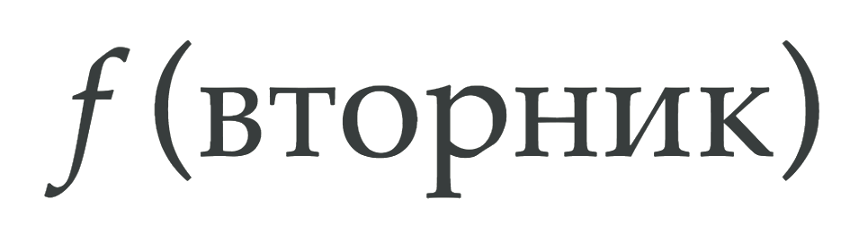

# *f*(вторник): введение

## Цикл статей о функциональном программировании в JavaScript



Мы начинаем знакомство с функциональным программированием в JavaScript и в сегодняшнем выпуске [функционального вторника](https://github.com/devSchacht/functional_tuesday) поговорим об основных столпах функционального программирования: декларативности, иммутабельности, функциях высшего порядка - обо всем этом и даже больше. Коротко о содержании:

* [Понятие функции](https://github.com/devSchacht/functional_tuesday/blob/master/articles/chapter1.md#Понятие-функции)
* [Чистая функция](https://github.com/devSchacht/functional_tuesday/blob/master/articles/chapter1.md#Чистая-функция)
* [Побочные эффекты](https://github.com/devSchacht/functional_tuesday/blob/master/articles/chapter1.md#Побочные-эффекты)
* [Состояние](https://github.com/devSchacht/functional_tuesday/blob/master/articles/chapter1.md#Состояние)
* [Неизменяемость](https://github.com/devSchacht/functional_tuesday/blob/master/articles/chapter1.md#Неизменяемость)
* [Декларативность](https://github.com/devSchacht/functional_tuesday/blob/master/articles/chapter1.md#Декларативность)
* [Функции высшего порядка](https://github.com/devSchacht/functional_tuesday/blob/master/articles/chapter1.md#Функции-высшего-порядка)
* [Функциональное программирование](https://github.com/devSchacht/functional_tuesday/blob/master/articles/chapter1.md#Функциональное-программирование)

## Понятие функции

Конечно же, как следует из названия, в корне функционального программирования лежит функция - понятие, пришедшее к нам из математики. В математике функция определяется следующим образом: правило `f`, по которому каждому элементу `x` множества `X` ставится в зависимость единственный элемент `y` множества `Y`. Или проще: закон отображения множества `X` на множество `Y`. Проще не стало? Тогда вы по адресу: в функциональном программировании такие определения не редкость. Сейчас разберемся.


В определении прозвучал термин зависимость - когда один элемент ставится в зависимость от другого элемента по определенному правилу. Хотите пример? Представьте, что вы бросаете камень. Вы абсолютно уверены, что дальность полета зависит от силы броска. Это общий закон. Другими словами: дальность полета есть функция силы броска. Представить такие отношения можно следующим образом: `y = f(x)`.

Если какая-то величина `y` зависит от другой величины `x`, говорят, что величина `y` есть функция величины `x`.

Конечно, камень бросить можно и без функции. Но зная закон зависимости, вы знаете, что нужно сделать сейчас, чтобы получить нужный результат потом. Если вы просто бросаете камень ради развлечения, то заранее знать результат броска вам не требуется, но потребуется, если захочется узнать, куда он попадет.


<br/>
*Этому парню точно требовалось знать результат заранее*

В нашем выражении слева стоит `y`. Это и есть функция. Под этим символом скрывается некая любая величина. Это может быть время, температура, пройденный путь, сила тока, зарплата - все, что угодно. Математике без разницы. `y` еще называется зависимой переменной.

Справа мы видим `x` в скобочках. Под `x` тоже может скрываться любая величина. `x` на этом месте (в скобочках) называется независимой переменной. Еще одно название для `x` - аргумент функции.

Также у нас есть символ `f`. Под ним скрываются все действия над `x`, какие только можно представить.

В этой записи важны не столько символы, сколько скобочки - `()`. Именно они показывают, что и от чего зависит. Символы могут быть любые другие: `g`, `p`, `t`, `s` и так далее.


<br/>
*Когда вы все это знаете, вы бросаете камни вот так*

Теперь решим одну математическую задачку.


Предположим, мы едем на автомобиле со средней скоростью `80 км/час`. Смотрим на карту и пытаемся оценить, где мы будем через два часа. Мы знаем закон, что пройденный путь `S` равен скорости `V`, умноженной на время `t`: `S = V·t`.

Для нашей скорости `80 км/час` формула становится такой: `S = 80·t`. Через два часа мы проедем `80·2 = 160 километров`. Таким образом, между временем и расстоянием существует связь.

Эту связь можно выразить знакомой нам функцией `y = f(x)`. Под `y` в нашем случае скрывается путь `S`. Это зависимая переменная, она зависит от времени. Под `x` скрывается время `t`. Это независимая переменная, потому что мы сами ее задаем и функция сработает при любом ее значении. А под символом `f` в нашей функции скрывается действие - умножение на 80! Это закон нашего конкретного случая, по которому время `t` превращается в путь `S`.

Используя наши символы, можно записать функцию `S = f(t)`. Она означает, что путь как-то зависит от времени. Это общая функция, для любого движения.

Мы много повторяем термины зависимость, связь, закон, правило - все они объединяются в понятии функции, квинтэссенция которой - взаимосвязь неких переменных величин.

Вы, конечно же, уже задаетесь вопросом: *«А о программировании будет?»*. Будет, куда же без него!


Рассмотрим функцию `multiplyByFive`.

```js
const multiplyByFive = (x) => 5 * x;

const y = multiplyByFive(4);

// y === 20;
```

Она принимает аргумент `x` и умножает его на `5`. Для `x = 4` результат будет `20`. В математическом понимании:

* `y` - зависимая переменная, наша функция
* `x` - независимая переменная или аргумент
* `multiply` - наша `f` - набор действий, которые нужно произвести над переданным `x` для получения `y`

По факту функция в математическом понимании делает следующее:

1. получает переменную
2. совершает над ней действия
3. возвращает переменную

И ничего больше! Просто и понятно. К этому стоит стремиться и в программировании! Однако, к сожалению, общее понятие функции в программировании звучит следующим образом: фрагмент программного кода, к которому можно обратиться из другого места программы. Это определение допускает слишком много вольностей *(о чем далее)*.

## Чистая функция

Чистая функция - это функция, которая при одинаковых аргументах всегда возвращает одни и те же значения и не имеет видимых побочных эффектов. Функция является чистой, если:

* принимает аргументы
* при одних и тех же аргументах производит одинаковый результат
* основывается только на внутреннем состоянии и не изменяет внешнее
* не производит побочных эффектов
* не может вызывать нечистые функции

Если посмотреть на уже знакомую нам функцию `multiplyByFive`, выражающую собой функцию в математическом понимании, то она же является чистой функцией:

```js
const multiplyByFive = (x) => 5 * x;

const y = multiplyByFive(4);

// y === 20;
```

Примером нечистой функции может служить этот код, написанный без оглядки на математическое понимании функции, а так, как нам позволяет писать JavaScript:

```js
const multiplyByFive = () => x * 5;

const x = 4;
const y = multiplyByFive();

// y === 20;
```

Что изменилось? Мы всего лишь перестали передавать аргумент. Это нарушает один из принципов чистой функции - принимать аргументы. При таком варианте стабильность нашего кода значительно ниже.

Можно рассмотреть еще одну нечистую вариацию функции `multiplyByFive`:

```js
let y;

const multiplyByFive = () => {
    y = 5 * x;
};

const x = 4;
multiplyByFive();

// y === 20;
```

Здесь нарушены практически все принципы чистой функции. Этот код сложно понимать и невозможно поддерживать, так как логика написана запутанно и любое вмешательство может привести к неожиданным последствиям.

Таким образом, функция в математическом понимании является чистой, но она не тождественная JavaScript функции. Следовательно, чтобы в JavaScript получить чистую функцию, нам необходимо писать функции в их математическом понимании.

Отличие функции в математическом понимании от JavaScript функции заключается в том, что функции в JavaScript могут опираться не только на аргументы, но и на состояние внешних переменных и изменять его, производя побочные эффекты. Это позволяет писать код быстрее и проще, но излишняя гибкость и возможности, которые дает JavaScript, могут привести к проблемам в будущем.

Написание и использование нечистых функций стоит избегать и по возможности всегда работать только с чистыми функциями, чтобы не оказывать влияние на окружения и при одинаковых входных данных всегда получать одинаковый, как парни в глазах девушек, результат.


## Побочные эффекты

Одним из нарушенных принципов чистой функции было наличие побочного эффекта. Побочный эффект - ситуация, когда функция или выражение изменяет состояние вне своего контекста. Примерами побочных эффектов могут служить: вызов API, манипулирование DOM, вывод alert, запись в базу данных и так далее. Если функция производит побочные эффекты, она считается нечистой. Такие функции менее предсказуемы и их труднее тестировать, поскольку они приводят к изменениям вне их локальной области видимости.

Полностью избежать побочных эффектов не получится: без них программа или скрипт попросту не сможет ни на что повлиять. Но работа с побочными эффектами должна быть контролируемой и осознанной. Иначе однажды все закончится выстрелом себе в ногу.


## Состояние

Что такое состояние, на который повлиял побочный эффект? Состояние - это информация, к которой программа имеет доступ и с которой может работать в определенный момент времени. Это могут быть данные, хранящиеся в памяти, порты ввода/вывода, базы данных и другое.

Пример функции, знающей о состоянии:

```js
var number = 1;

function increment() {
  return number++;
}

// глобальная переменная изменяется: number = 2
increment();
```

Программы, приложения или компоненты с состоянием хранят в памяти данные о текущем состоянии. Они могут изменять состояние, а также имеют доступ к его истории.

```js
var number = 1;

function increment(n) {
  return n + 1;
}

// глобальная переменная НЕ изменяется: возвращает 2
increment(number);
```

Функции или компоненты без состояния выполняют задачи, словно каждый раз их запускают впервые. Они не ссылаются или не используют в своем исполнении раннее созданные данные. Отсутствие состояния обеспечивает ссылочную прозрачность (любое выражение можно заменить его значением). Функции зависят только от их аргументов и не нуждаются в знании чего-либо вне их области видимости. Им не нужно знать весь ваш план.


Управление состоянием важно для любого сложного приложения. Функции или компоненты с состоянием изменяют состояние и его историю, их труднее тестировать и отлаживать. Функции без состояния полагаются только на свои входные данные для создания данных выходных. Программа без состояния возвращает новое состояние, а не модифицирует существующее состояние.

## Неизменяемость

Неизменяемость - ключевая особенность функционального программирования. Выглядит она примерно так:


Когда элемент неизменяемый, его значение не может быть изменено после создания. В свою очередь изменяемый элемент изменен быть может.

JavaScript — язык с сильной изменяемостью и состоящий из множества парадигм. В отличии от функциональных языков, при написании функционального JavaScript, реализация неизменяемости требует внимательности. Если вы что-то нечаянно модифицируете, JavaScript не станет выбрасывать ошибки. Тестирование и библиотеки могут помочь, но работа с неизменяемостью в JavaScript потребует практики и методологии.

Плюсами неизменяемости являются:

* код проще понимать
* персистентность (существование в течении длительного времени)
* возможность хранения более старых версий структур данных

Минус неизменяемости в том, что многие алгоритмы и операции не могут быть эффективно реализованы.

## Декларативность

Если мы пишем функциональный код, мы пишем декларативно. Императивный код отвечает на вопрос: «*Как* достичь результата?». Декларативный код: «*Что* достичь?».

Если вы использовали цикл `for`, вы писали императивный JavaScript. При декларативном написании кода компьютер сам заботится о том, как достичь конечного результата без явного описания этого разработчиком. Если вы использовали `Array.map`, вы писали декларативный JavaScript.

Пример императивного кода:

```js
function incrementArray(arr) {
    let resultArr = [];
    for (let i = 0; i < arr.length; i++) {
        resultArr.push(arr[i] + 1);
    }
    return resultArr;
}
```

Эта функция описывает логику работы *как*: мы выполняем обход массива и явно увеличиваем каждое число, помещая его в новый массив. Затем мы возвращаем результирующий массив. Это пошаговое описание логики функции.

Пример декларативного кода:

```js
function incrementArray(arr) {
    return arr.map(item => item + 1);
}
```

Здесь мы показываем, *что* хотим достичь, но не как это работает. Метод `Array.map()` возвращает новый массив с результатами выполнения обратного вызова для каждого элемента из переданного массива. Этот подход не изменяет существующие значения и не включает в себя последовательную логику, раскрывающую, как он создает новый массив.

Возьмем пример с нашей чистой функцией `multiplyByFive`:

```js
const multiplyByFive = (x) => 5 * x;

const y = multiplyByFive(4);

// y === 20;
```

Когда нам нужно умножить `4` на `5`, мы не будем указывать как это сделать. Мы просто скажем, что нам нужно умножить на `5` - `multiplyByFive` - это и есть наш набор действий.

А если нам понадобится пицца на крыше, то мы скажем [Хайзенбергу](https://ru.wikipedia.org/wiki/Уолтер_Уайт) *что* нам нужно, а уж он знает, как это организовать.


## Функции высшего порядка

Функция высшего порядка - функция, принимающая другую функцию в качестве аргумента или возвращающая функцию в результате.

В JavaScript функции являются объектами первого класса - элементы, которые могут быть переданы как параметр, возвращены из функции, присвоены переменной. Они могут храниться и передаваться как значения: мы можем присвоить функцию переменной или передать функцию другой функции.

Присвоим переменной функцию:

```js
const double = function(x) {
    return x * 2;
}

const timesTwo = double;

timesTwo(4); // результат: возвращает 8
```

Еще один пример:

```js
function sayHi() {
    alert('Hi!');
}

function greet(greeting) {
    greeting();
}
greet(sayHi); // "Hi!"
```

Обратите внимание, что при передаче именованной функции в качестве аргумента мы не используем круглые скобки `()`. Таким образом мы передаем функцию как объект. Круглые скобки выполняют функцию и передают результат вместо самой функции.

Функции высшего порядка также могут возвращать другую функцию:

```js
function whenMeetingJohn() {
    return function() {
        alert('Hi!');
    }
}

var atLunchToday = whenMeetingJohn();

atLunchToday(); // "Hi!"
```

Именно функции высшего порядка делают возможным функциональное программирование в Javascript и они действительно мощны.


## Функциональное программирование

Подводя итог, можно дать множество определений функционального программирования:

* парадигма программирования, рассматривающая вычисления как вычисления значений функций в математическом понимании последних (в отличие от функций как подпрограмм в процедурном программировании)
* парадигма программирования, избегающая изменяющихся состояний и данных
* парадигма программирования, использующая декларативный подход: программирование осуществляется с помощью выражений (деклараций) вместо операторов
* парадигма программирования, при которой выходное значение функции зависит только от аргументов, передаваемых функции, поэтому вызов функции `f` дважды с тем же значением аргумента `x` будет каждый раз приводить к одному и тому же результату `f(x)`

И, поверьте, это еще не все.

Минусами функционального программирования можно названия отсутствие широкого распространения на практике и высокие требования к количеству памяти. Зато сколько плюсов:

* отсутствие багов
* переиспользование функций
* параллельное исполнение
* производительность
* инкапсуляция логики в чистых функциях
* модульность
* поддержка и понимание
* тестируемость

Всегда помните, что каждая парадигма обладает своими плюсами и минусами, меняющимися в зависимости от задачи. Но... функциональное программирование все равно круче!


## Использованная литература и дополнительная информация

* [Справочник современных концепций JavaScript: часть 1](https://medium.com/devschacht/glossary-of-modern-javascript-concepts-1198b24e8f56)
* [Функция, производная, графики](http://helpmatan.ru/)
* [Mostly adequate guide to FP](https://github.com/MostlyAdequate/mostly-adequate-guide-ru)
* [Higher Order Functions (Composing Software)](https://medium.com/javascript-scene/higher-order-functions-composing-software-5365cf2cbe99)
* [Why Learn Functional Programming in JavaScript? (Composing Software)](https://medium.com/javascript-scene/why-learn-functional-programming-in-javascript-composing-software-ea13afc7a257)
* [Functional JavaScript](https://github.com/jcouyang/functional-javascript/tree/master/en)
* [Compare Functional Programming, Imperative Programming and Object Oriented Programming](http://www.journaldev.com/8693/functional-imperative-object-oriented-programming-comparison)

[Эта статья в виде презентации](https://devschacht.github.io/functional_tuesday/presentations/chapters/chapter_1.html#/).

Выпуск подготовлен совместно с [Вадимом Яловенко](https://github.com/yalovek).

----

*Слушайте наш подкаст в [iTunes](https://itunes.apple.com/ru/podcast/девшахта/id1226773343) и [SoundCloud](https://soundcloud.com/devschacht), читайте нас на [Medium](https://medium.com/devschacht), контрибьютьте на [GitHub](https://github.com/devSchacht), общайтесь в [группе Telegram](https://t.me/devSchacht), следите в [Twitter](https://twitter.com/DevSchacht) и [канале Telegram](https://t.me/devSchachtChannel), рекомендуйте в [VK](https://vk.com/devschacht) и [Facebook](https://www.facebook.com/devSchacht).*

[Выпуск на Medium](https://medium.com/devschacht/ftuesday-introduction-c2ed010bb75d)
